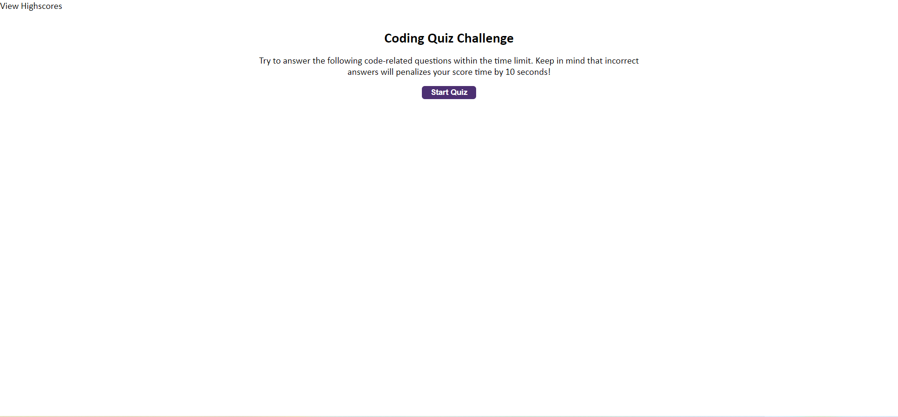
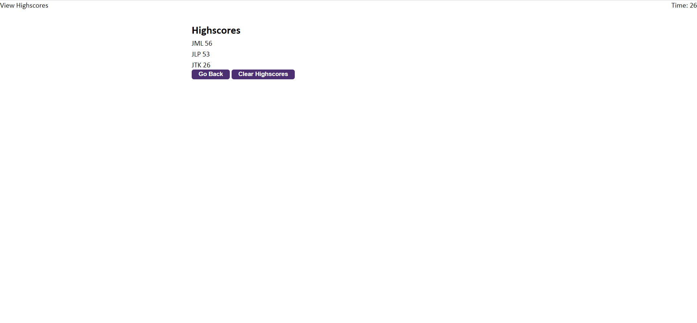
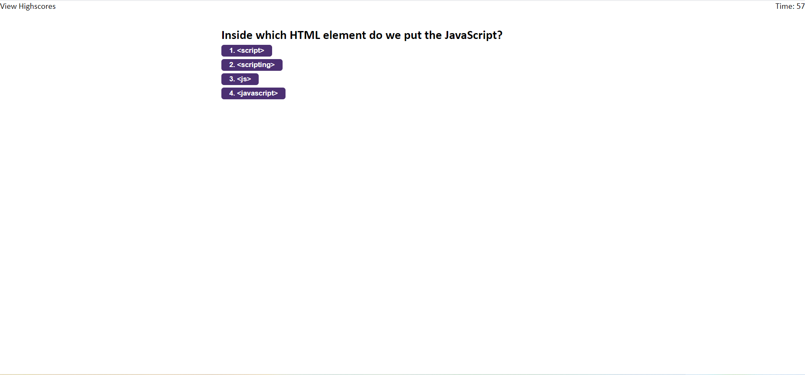

# JS Quiz

A fully functional five question quiz on some basics of JavaScript. The quiz is timed with one minute to complete all of the questions. Any incorrect answer will remove 10 seconds from the timer. The final score is equal to the time left on the clock. 

Scores are saved between plays in the local storage and are cleared when the "Clear Highscores" button is clicked on the Score Board.

https://andrewroddy92.github.io/js-quiz/